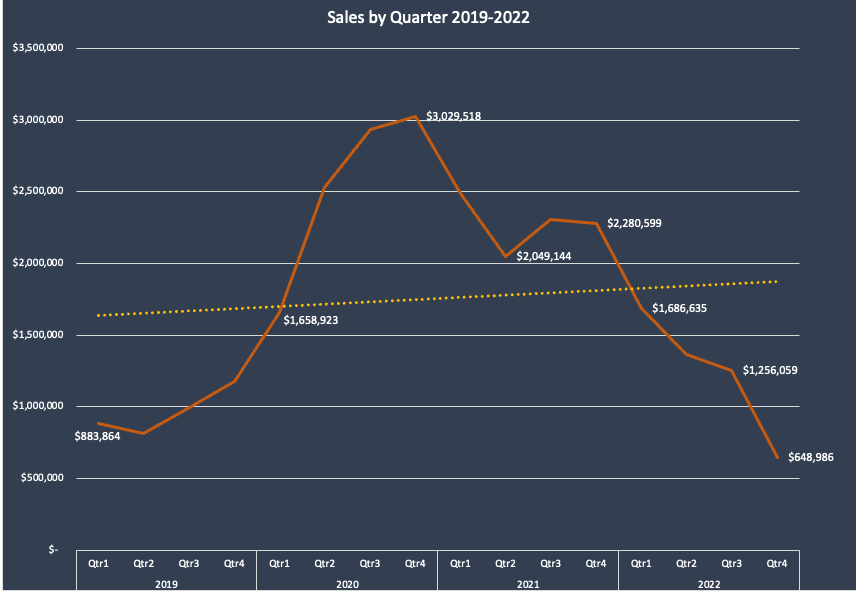

 # Crossway-Electronics

Crossway Electronics is an e-commerce company founded in 2018 that sells consumer tech products online. They have gathered a wealth of data over the past few years and want to run an analysis of how their business has performed between 2019 and 2022. Crossway is interested in learning about general trends as well as what has impacted their sales across refunds, products and regions. They also want to know if the Loyalty Program is worth continuing.

# High-Level Insights
 After the startup period in 2019 sales began to steadily increase. However, 2020 saw a major boost in sales in March coinciding with the beginnig of the Covid-19 pandemic lockdowns.**Strong sales peaks were seen in 2020, particularly in Q1 and Q4, but after that, there was a steady decline in 2021 and 2022**. 
 This might indicate unsustainable growth or challenges in maintaining that level of sales.
* Peak months: November and December show substantial positive growth, which could indicate holiday sales or end-of-year promotions driving the increase.
* Off-peak months: February and October consistently show negative growth, suggesting that the business may need to address slower seasons with targeted marketing or product launches to counteract dips.

## Sales Trends

  

  

**Overall Trend**: There is a significant variation in sales growth over the years.  
* 2019: Growth rate of 163%, indicating strong performance during this year.
* 2020: A slight negative growth of -10%, showing a dip in sales.
* 2021: A significant decline of -46%, indicating a major drop in sales performance.
* 2022: A drastic decrease with -100%, showing no sales growth or a complete loss in this year.

**Quarterly Trends:**
* Q1 2020 and Q4 2020: Strong growth, with sales reaching up to $3M.
* 2021: Sales initially high but started declining in Q3 and Q4.
* 2022: Consistent decline across all quarters, with a dramatic drop in Q4, nearing $600K.

## Seasonal Trends

  

**Overall Seasonality**: There is a noticeable fluctuation in monthly sales trends.
* March, November, and December: High positive sales growth, especially in December (over 20%).
* February, October, and June: Significant negative growth, especially in February and October (greater than -20%).
* Other months: Minor fluctuations with mostly positive trends in spring and fall months.
