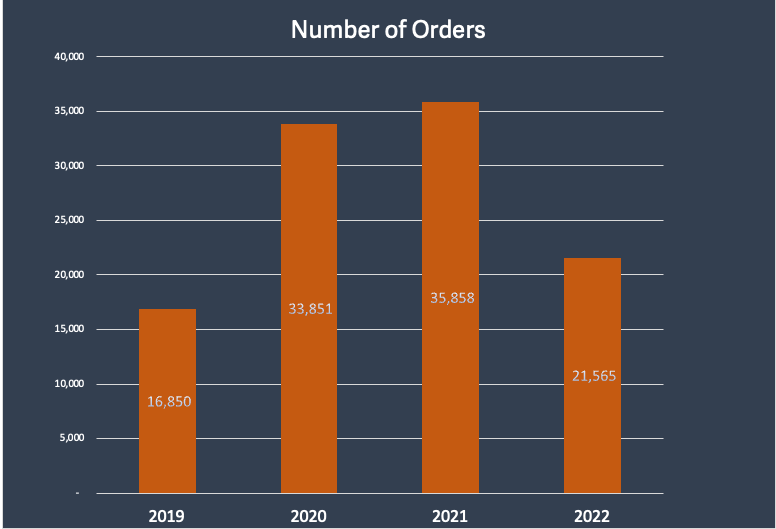

 # Crossway-Electronics

   

Crossway Electronics is an e-commerce company founded in 2018 that sells consumer tech products online. They have gathered a wealth of data over the past few years and want to run an analysis of how their business has performed between 2019 and 2022. Crossway is interested in learning about general trends as well as what has impacted their sales across refunds, products and regions. They also want to know if the Loyalty Program is worth continuing.

# High-Level Insights
 After the startup period in 2019 sales began to steadily increase. However, 2020 saw a major boost in sales in March coinciding with the beginnig of the Covid-19 pandemic lockdowns.**Strong sales peaks were seen in 2020, particularly in Q1 and Q4, but after that, there was a steady decline in 2021 and 2022**. 
 This might indicate unsustainable growth or challenges in maintaining that level of sales.
* Peak months: November and December show substantial positive growth, which could indicate holiday sales or end-of-year promotions driving the increase.
* Off-peak months: February and October consistently show negative growth, suggesting that the business may need to address slower seasons with targeted marketing or product launches to counteract dips.

## Sales Trends

  

 

  

**Overall Trend**: There is a significant variation in sales growth over the years.  
* 2019: Growth rate of 163%, indicating strong performance during this year.
* 2020: A slight negative growth of -10%, showing a dip in sales.
* 2021: A significant decline of -46%, indicating a major drop in sales performance.
* 2022: A drastic decrease with -100%, showing no sales growth or a complete loss in this year.

**Quarterly Trends:**
* Q1 2020 and Q4 2020: Strong growth, with sales reaching up to $3M.
* 2021: Sales initially high but started declining in Q3 and Q4.
* 2022: Consistent decline across all quarters, with a dramatic drop in Q4, nearing $600K.

**Yearly Comparision**
* 2019: Lowest order volume at 16,850 orders.
* 2020: A significant increase to 33,851 orders, showing a 100%+ growth.
* 2021: Slight growth to 35,858 orders, showing consistency from the previous year.
* 2022: Significant drop to 21,565 orders, showing a 40% decline from 2021.

## Seasonal Trends

  

**Overall Seasonality**: There is a noticeable fluctuation in monthly sales trends.
* March, November, and December: High positive sales growth, especially in December (over 20%).
* February, October, and June: Significant negative growth, especially in February and October (greater than -20%).
* Other months: Minor fluctuations with mostly positive trends in spring and fall months.

## Product Analysis

   

- The **Gaming Monitor, Apple Airpods, Macbook Air, and Thinkpad Laptop** were the highest earning products earning **more than 95% of sales**.
- The Apple Airpods were the most popular product overall with almost 50,000 orders which is double the next most popular product. The Samsung Chargepack was another notably popular product, but its smaller pricepoint meant that it did not contribute as much in sales.
- Compared to the other Apple products, the iPhones lacked substantially accounting for less than 1% of overall sales and orders.
- Purchases across most products occured on the **website earning $27 Million** over the four years compared to just **$800,000 on mobile**.
- The majority of orders attribute "direct" marketing as the main contributor to the sale which accounted for **$23 million**. "Email" was the second with over $3 million.
- The Bose Soundsport Headphones has contradicting performance to the above with all orders occurring on mobile and attributed to email marketing.

## Loyalty Program

  

Loyalty Program grew significantly with the COVID bump. It accounted for more than half of orders by 2021, but stagnated ever since.

Guest Checkouts seem largely responsible for the boom in AOV in 2020 spending more per sale than loyalty members. After the boom, however, loyalty program members spend more on average than guest checkout. 

**Should Apollo continue the loyalty program?**

The loyalty program has improved over time, climbing in AOV through the years and accounting for roughly half of sales in 2021 and 2022. Ultimately, there is no reason to remove the loyalty program at this point.

## Regional Analysis
North America accounted for half of sales and orders with EMEA (29%), APAC (12%) and LATAM (7%) accounting for the rest. All regions followed the same general trend lines for sales and orders.

 ## Recommendations:
 The pandemic bump was drastic and Apollo was not able to sustain its growth, but a few opportunities could help the company push for the future.
 
- There have been no new product offerings introduced into the lineup since the Beats Soundsport Headphones and the Samsung Webcam in 2020. Laptops contribute to high sales dollars but highly priced items also have the highest return rates. The Apple Airpods were excellent performers given their relatively low return rates and high sales contributions.
- The Loyalty Program has been showing signs of improvement in 2022. Continuing the program would allow us to collect more data.
